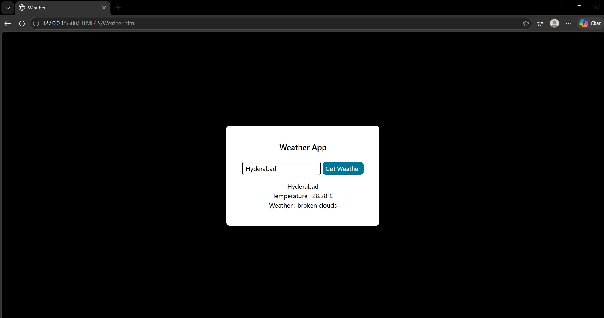

# Weather App

A weather application that fetches and displays weather information using a Weather API.

## Features

- Enter a city name
- Fetch weather information
- Display temperature
- Display current weather condition

## Technologies Used

- HTML5
- CSS3
- JavaScript
- Weather API

## How to Run

1. Clone this repository.
2. Open `index.html` in your web browser.
3. Enter a city name.
4. Click the **Get Weather** button.
5. View the weather information displayed on the page.

## Project Preview

